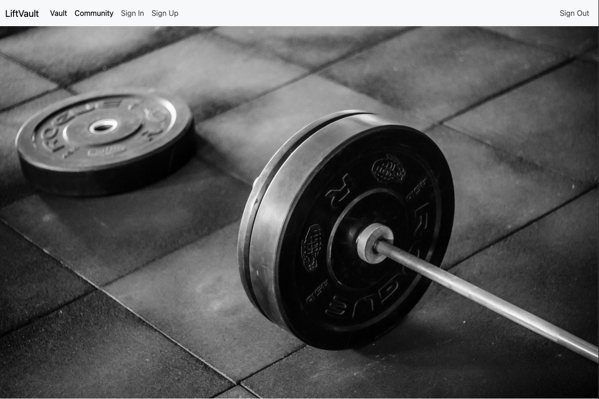
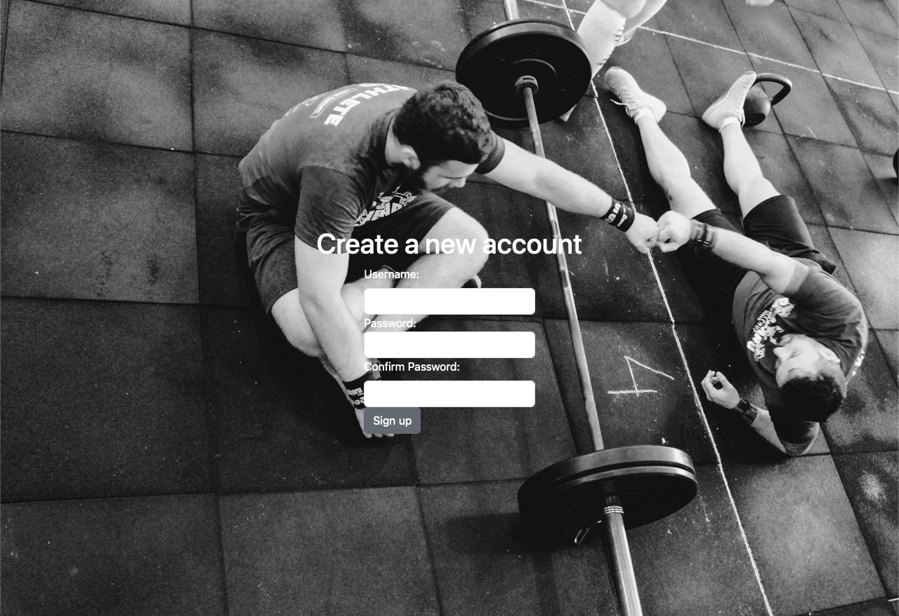
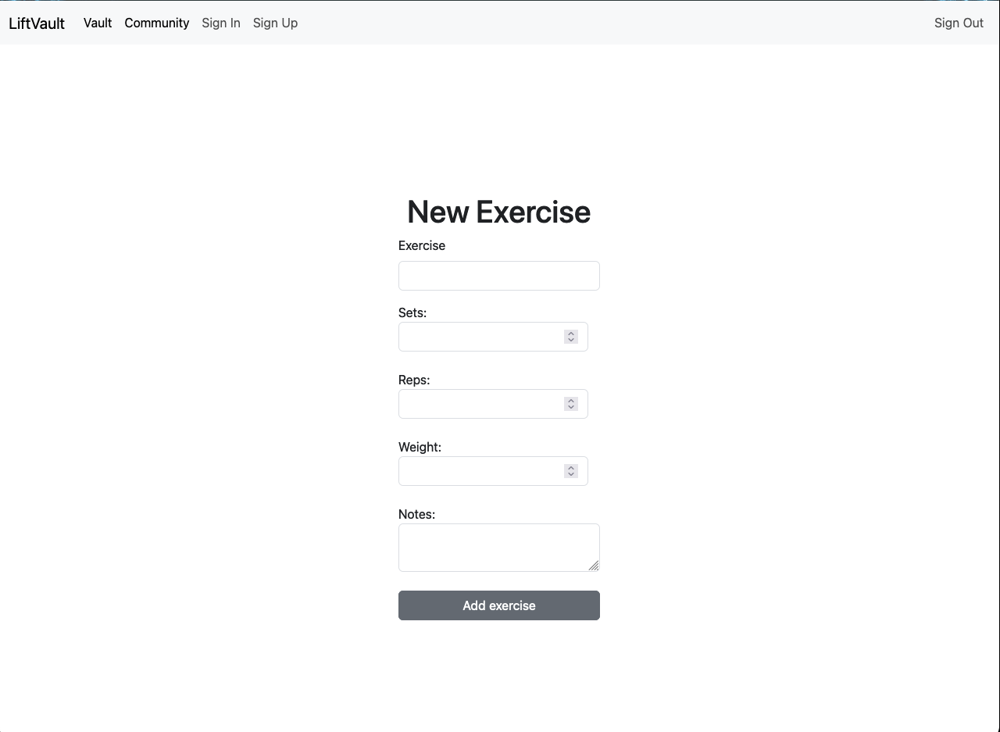

# LiftVault

*LiftVault* is a simple exercise logbook. The app allows the user to log specific exercises along with the accompanying weight, sets, reps, and notes. It also allows users to view other users' exercise 'vaults'.

Click the below link to view the app on Heroku.

[LiftVault](https://lifts-tracker-8df7c3ccd50b.herokuapp.com/)

## How it works
Users are required to sign-up with their own account. 

Once signed-up, users will need to sign in. Once signed-in, users can navigate to their 'vault' and click on 'log a new exercise' to create a new entry. Users will be prompted to log a specific exercise as well the number of sets, and reps completed. Users can enter a weight for the exercise if necessary. Entering a weight is not required. There is also the option to log any notes to go with a new entry.

Once a new entry is entered into the system, users can view the entry in their vault.

Users are able to choose from a list of specific exercises. These include,

* back squat
* barbell back rack reverse lunge
* barbell good morning
* behind the neck press
* bench press
* bent over dumbbell row
* chin up
* clean
* clean pull
* dumbbell box step up
* deadlift
* deficit deadlift
* dumbbell bench press
* front squat
* hang clean
* hang muscle snatch
* hang power clean
* hang power clean + push jerk
* hang snatch
* hang power snatch
* hang squat snatch
* hip clean
* hip snatch
* low hang power clean
* low hang snatch + overhead squat
* overhead squat
* power clean
* power clean + jerk
* power snatch
* push jerk
* push press
* romanian deadlift
* seated barbell strict press
* single arm dumbbell row
* snatch
* strict press
* pull up
* bar muscle up
* ring muscle up
* strict ring muscle up
* strict handstand push up

As the app develops, new exercises will be added for users to access.

A specific exercise will only appear in a users vault once. To view the history of the specific exercise, users can click on the exercise itself to view it's history. On this page, all logs for the specific exercise can be seen so a user is able to see their progression over time.

Users can also navigate to the community page to view other user's 'vaults'.

## Built with
LiftVault was made using a combination of MongoDB, Express, and Node.

## Features
* User authentication
* Ability to log and store a user's history of exercises.
* Community page to view other user's exercise logs ('Vaults').

## Credits
CSS was built with [Bootsrap](https://getbootstrap.com/) along with custom CSS.

Images were sourced from [Unsplash](https://unsplash.com/). Credit to [Victor Freitas](https://unsplash.com/@victorfreitas) for the specific images.

Further credit to CJ for his assistance throughout the building of the app.

## Next Steps

There are plenty of things I would love to add to this app in the future. These include:

* Additional CSS to make the app feel more interactive.
* The ability for users to 'like' and 'comment' on other users' entries.
* Add [Bootstrap's](https://getbootstrap.com/docs/5.3/components/accordion/) 'Accordion' to the user's 'vault' and exercise history page. Ideally, this would allow the user to view their exercise history for specific exercises all on the same page, with some interactive CSS. I did attempt this but could not get it working in time.
* A 1 rep max calculator. This would apply the Brzycki formula to calculate a 1 rep max for each exercise, based on a users exercise history.
* I have left Cloudinary and Multer middleware in the code. Whilst it is not being used for anything now, I woud like to add the ability for users to add their own images to their exercise logs in the future.